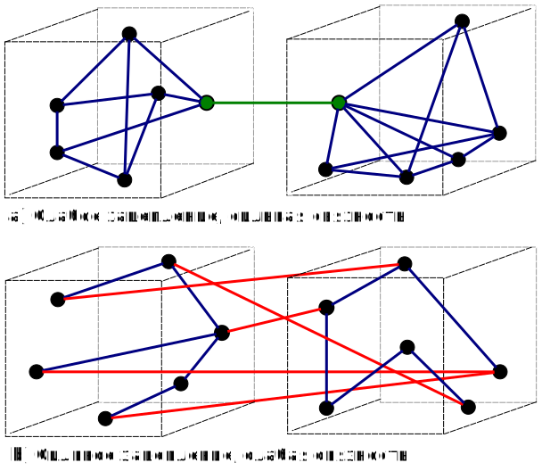
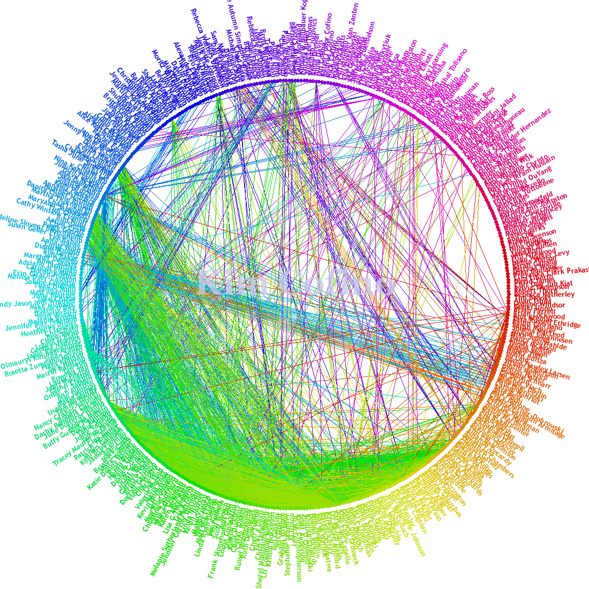
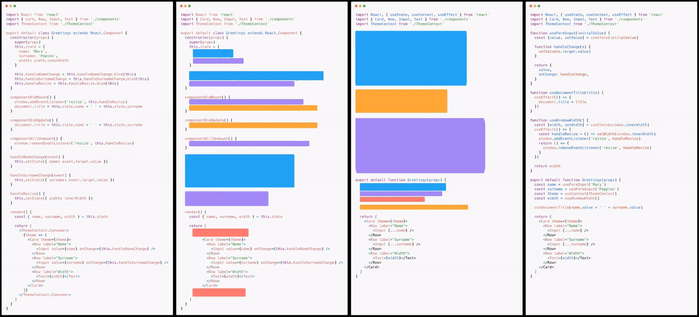

<!--
## Обо мне.

Больше 5 лет в ИТ: в разное время поддерживал, запускал, разрабатывал проекты в крупнейших финансовых компаниях РФ. Сейчас специализируюсь на разработке web-приложений: React.js и все что рядом. Люблю учиться и люблю это делать не в ширь, а в глубь, сейчас интересуюсь историей программирования и математическими науками.
## Название.

Формальная и интуитивная семантика языка программирования на примерах JS и JSX.

## Описание.

Всем известно что одну задачу, в большинстве своем, можно решить (запрограммировать) несколькими способами. Каждый из способов может отличаться архитектурой, паттернами, а так же кодстайлом, но как это выражать в максимально понятном виде, что может дать язык программирования для улучшения явности кода?

Я расскажу, на практических примерах, про фундаментальные характеристика языков программирования, которые дают понимание как писать понятный, дешевый (т.е. поддерживаемый) код в независимости от технологического стека.

## (для ПК)
Доклад я пишу вместе со статьёй (https://github.com/artalar/blog/blob/master/src/pages/semantics-in-programming.md), которую хотел бы опубликовать после доклада. Немного я уже затрагивал некоторые темы в своем предыдущем докладе: https://youtu.be/dCXvQkvSyQg?t=1663
-->

# Формальная и интуитивная семантика языка программирования на примерах JS и JSX.

<!-- Мне как Христианину ответ на первый вопрос не нужен, а вот с кодом не понятно... -->

> О чем этот материал: о̶т̶в̶е̶т̶ ̶н̶а̶ ̶г̶л̶а̶в̶н̶ы̶й̶ ̶в̶о̶п̶р̶о̶с̶ ̶ж̶и̶з̶н̶и̶,̶ ̶в̶с̶е̶л̶е̶н̶н̶о̶й̶ ̶и̶ ̶в̶с̶е̶г̶о̶ ̶т̶а̶к̶о̶г̶о̶ как писать понятный код?

## Введение

Мотивацией к написанию данного материала послужила постоянная сложность возникающая от чтения чужого кода, которая, должно быть, появляется у каждого. Какие-то конструкции кажутся избыточными или излишне сложными, какие-то вообще ошибочными. Иногда сложно понять какую бизнес-задачу пытался решить автор и, в частности, какие особенности языка или стека ему в этом мешали. И свой код спустя некоторое время становится малопонятным. Кажется, эта самая понятность исходит из контекстов: продукта, проекта, архитектуры и стека (фреймворки, библиотеки), команды и принятому кодстайлу. С этим ничего не сделаешь, просто приходится вновь погружаться во все эти контексты и искать связи между ними - только тогда каждая конструкция в коде обрастает понятной мотивацией, страх перед неизвестностью проходит и желание все переписать стихает.

Но, бывает, можно натолкнуться на чужой, совершенно неизвестный код, который выглядит лаконичным и понятным. Сразу ясно какую задачу он решает и как. Причем такой код может быть даже на другом языке программирования или с использованием неизвестного стека, но, почему-то, он нормально читается, **интуитивно** рассказывая свою историю.

Вот я и задался вопросом, есть ли, все же, какие-то универсальные правила построения и структурирования кода, которые бы не зависели от конкретного языка программирования или стека? Я решил попробовать найти ответ на этот вопрос копнув в самую глубь, изучив что такое язык программирования в общем и какие он может иметь обобщенные особенности из которых можно вывести правила лучших практик. Получилось поверхностное исследование, которое лишь приоткрыло всю глубину, сложность и историю вопроса, но определяющее четкое направление пути.

## Декларативность

Многие называют "декларативное" программирование панацеей понятности и читаемости, но так ли это на самом деле? Почему кто-то с этим согласен на все 100%, а кто-то совершенно не разделяет энтузиазма по этому поводу? Как может панацея для кого-то НЕ быть панацеей - это безсмыслица. Нужно разобраться.

Все, наверное, слышали чем декларативное программирование отличается от императивного: декларативное описывает **что** нужно сделать, а императивное **как** нужно сделать. Но говоря об этом обязательно стоит помнить, что при декларациях того что нужно сделать идет оперирование какими-то **существующими** элементами, о которых мы знаем **как** они работают (иначе наши декларации ничего бы не стоили). Декларативное программирование — это способ описания программы через набор **верхнеуровневых** инструкций, детали реализации и исполнения которых скрыты за исполнителем этих инструкций. Под исполнителем могут подразумеваться: функции высшего порядка (ramda, react, redux-saga), макросы (JSX) в случае кодогенерации, JIT компилятор в случае исполнения (синтаксис ЯП - языка программирования), машинные коды - декларативное описание логики переключения транзисторов процессора. Т.е. средство описания [деклараций] всегда имеет какой-то контекст и "декларативность" означает не какой-то конкретный паттерн, а текущий уровень восприятия глубины абстракции разработчиком.

Например, классическим примером декларативного программирования является код в функциональном стиле:

```js
array.filter(predicate)
```

Но что можно сказать про такой код:

```js
instruction = { type: 'filter', target: array, arguments: [predicate] }
```

Он более декларативен - в нем нет прямого вызова функций, а только описание того что нужно сделать. Но как такое может быть, есть градации декларативности? А лучше ли этот код в плане читаемости и понимаемости? Кажется ответ не совсем однозначный.

Так же можно рассмотреть классический "императивный" код:

```js
for (let i = 0; i < array.length; i++) {
  if (predicate(array[i])) result.push(array[i])
}
```

Он кажется более сложным, чем приведенные снипеты выше, но если посмотреть на результирующий машинный код, то код с `for` и `if` покажется вполне простым и декларативным, т.к. он скрывает то **как** работать с памятью на системном уровне.

Из всего этого можно сделать простой вывод, "декларативность" - это термин для определения уровня абстракции, который для каждого человека может быть разным, в зависимости от контекста.

---

<!-- https://gist.github.com/artalar/6de0d1778bb62634214b69dbcb7090cb -->
<!--  -->

```js
export const validateFormFields = state => {
  const displayedFields = selectFormFieldsNames(state)
    .map(name => selectFormField(state, name))
    .filter(isSystem);

  const arrayFields = displayedFields.filter(isArray);

  const emptyRequiredArraysErrors = arrayFields
    .filter(field => isArrayEmpty(field) && field.required)
    .map(field => selectFriendlyText(state, field.title, field.name));

  const arrayCellsErrors = arrayFields
    .filter(field => !isArrayEmpty(field) && isTable(field))
    .reduce((acc, field) => [...acc, ...validateArrayCells(state, field)], []);

  const notArrayFields = displayedFields.filter(field => !isArray(field));
  const notArrayFieldsErrors = notArrayFields
    .filter(field => field.required && isValueExist(field.value))
    .map(field => selectFriendlyText(state, field.title, field.name));

  return [
    ...notArrayFieldsErrors,
    ...emptyRequiredArraysErrors,
    ...arrayCellsErrors
  ];
};
```

VS

```js
function validateFormFields(state) {
  const fieldsNames = selectFormFieldsNames(state);
  const result = [];

  for (let i = 0; i < fieldsNames.length; i++) {
    const field = selectFormField(state, fieldsNames[i]);

    if (isSystem(field)) continue;

    if (!isArray(field) && field.required && isValueExist(field.value))
      result.push(selectFriendlyText(state, field.title, field.name));

    if (!isArray(field)) continue;

    if (isArrayEmpty(field) && field.required)
      result.push(selectFriendlyText(state, field.title, field.name));

    if (!isArrayEmpty(field) && isTable(field))
      result.push(...validateArrayCells(state, field));
  }

  return result;
}
```

Как-то на ревью ПР на работе я увидел чрезмерно "функциональный" подход в написании определенного набора действий и попробовал переписать этот код на "императивщину". Детали кода не важны, но на снимке экрана видно, что "императивный" код (справа) короче и в нем лучше выделены смысловые конструкции за счет их подсветки, а еще он производительнее. Но спрашивая коллег многие высказывались за то что функциональный код им нравится больше и стоит использовать его. Тогда я устроил голосование в чате. Как же было забавно наблюдать за тем как мнение делится поровну и кому-то был понятнее функциональный подход, а кому-то императивный:

<!--  -->


За функциональный подход откликалось в дискуссию большее количество людей и многие из них были разработчиками с многолетним опытом - им хотелось доверять, но при этом результаты голосования показывали что не все так однозначно. В действительности те кто имел опыт и привык работать с библиотеками в функциональном стиле просто привыкли к такому паттерну и образу мышления, но это не означает что он является единственно верным.

И функциональный и императивный код решают одну и ту же задачу и дают один и тот же результат, но совершенно по разному читаются, воспринимаются и даже исполняются в JIT. Проще говоря - эти два кода имеют разную **семантику**.

P.S. код был в итоге переписан в функциональном стиле, но с вынесением определенной логики в отдельные функции.

---

## Семантика

В изучении проблематики вопроса у меня не сразу получилось сформулировать о чем, с формальной точки зрения, вообще идет речь, есть ли для этого термин? Конечно я не первый задавался вопросами читаемости и явности кода, и на этот счет есть не мало трудов. Но большинство ответов (из первых страниц поисковых запросов и популярных книг по программированию) выдавали перечень прикладных советов, часть из которых могут быть реализованы только в некоторых языках (зависят от синтаксиса). Хотелось найти первопричину, а к ней простое и универсальное - элегантное решение, в котором не было бы противоречий. Например, следуя классическим советам, проектируя переиспользуемые компоненты очень сложно избежать ["зацепленности"](https://ru.wikipedia.org/wiki/Связность_(программирование)). И наоборот, упрощая абстракции в коде снижается портированность и переиспользование его частей (повышается связанность).

<!--  -->
<!--  -->


Явность кода - это не про code style, в плане визуального форматирования и именования переменных. Явность кода зависит от множества контекстов - это про микро и макро архитектуру всего приложения и принятых стандартов написания кода - это касается многого, но можно ли это обобщить? И тут я подумал - что объединяет все языки программирования - то что это **языки** программирования.



**Язык** в общем и язык программирования в частности - это **синтаксис** и **семантика**. Две ключевых составляющих, которые определяют что такое язык, как им пользоваться и выражать на нем свои мысли. И если с синтаксисом все более-менее понятно - это описание ключевых слов и т.п., то что такое семантика можно долго и упорно (не) понимать, хотя я догадывался - что все ответы, на вопросы явности кода, в ней.

Вообще язык сам по себе - это сложная комплексная сущность, формализованные части которой так же сложно понять. Википедиа говорит:

**Си́нтаксис** (др.-греч. σύν-ταξις — составление) — раздел лингвистики, изучающий строение и функциональное взаимодействие различных частей речи в предложениях, словосочетаниях и пр. языковых единицах.

**Сема́нтика** (от др.-греч. σημαντικός «обозначающий») — раздел лингвистики, изучающий смысловое значение единиц языка.

> **Семантика** отвечает за смысловое значение - явность выражения мысли.

Ну вот определения, ну вот они что-то описывают, но что это в действительности значит и как это можно использовать? Все понимается проще на аналогиях и можно попытаться найти их для определения синтаксиса и семантики, применительно к ЯП. Мне нравится такая: если синтаксис - это какой-то инструмент, то семантика - это правила пользования инструментом.


Если попробовать детально разобраться в семантике, как составляющей программного языка, то можно прийти к истории, общей теории языков программирования и, в частности, области компиляторов и формальному (математическому) доказательству корректности программ. На этот счет есть хорошая вводная [лекция](https://youtu.be/FtSWlpKuOKI) университетского курса "Языки программирования и компиляторы". Я немного перескажу ее.

Эволюция ЯП в улучшении абстракций: машинные коды, переменные (асемблер), процедуры и условные переходы (фортран), структуры (алгол68, паскаль), ООП, функции высшего порядка и развитые системы типов. Сейчас мы, программисты, пользуемся этим, зачастую, незадумываясь как работают языки высокого уровня, какая история за ними стоит и почему они именно такие, какие есть. Но интересно то что сам принцип ЭВМ в процессе развития языков не менялся.

Вычислительная машина - это большой конечный автомат, точнее конечный преобразователь (трансдьюсер). Ее инструкции - набор переходов. Человеку сложно оперировать такими понятиями, особенно в большой программе, он в принципе мыслит иначе и для [быстрого] понимания чего-то часто применяет **интуицию** и абстракции, обобщая логику описания поведения (программы). Мостом же между инструкциями вычислительной машины и человеком выступает интерфейс, который называется язык программирования. Вообще при написании кода и выражения задачи в виде набора операторов, все что происходит - это перебор возможных вариантов работы с возможными данными - попытка описать строго-формальным языком какую-то абстракцию - бизнес-задачу. И этот процесс (и код, в частности) очень похож на формальное математическое доказательство - бескомпромиссное, четкое выведение верного решения. Эта похожесть называется ["Соответствие Карри — Ховарда"](https://ru.wikipedia.org/wiki/Соответствие_Карри_—_Ховарда). Но отличие математического доказательства от написания программы заключается в том что логика построения программы, в первую очередь, строится не на формальных доказательствах, а интуитивных умозаключениях программиста, которые он уже пытается наложить на формальные правила ЯП. Потому что каждую задачу можно описать на ЯП по разному. Это, в частности, зависит и от личного представления программиста о задаче, от его привычек и способа мышления, знания и умения использовать то или иное API языка, библиотек, фреймворков. Но как соотнести абстрактное представление программиста о задаче с четким и формальным алгоритмом, можно ли формализовать это соотношение? Есть ли какое-то правило, функция, которая описывает и представляет разницу между индивидуальным кодом программиста и формальным необходимым результатом - что определяет соответствие мысли программиста и того что будет делать код? Вот это, как раз, и называется **семантика**.

> Синтаксис - для парсинга AST и построения структуры программы

> Семантика - для понимания программы компилятором и интерпретатором

В итоге. **Семантика позволяет конкретизировать до формального уровня интуитивное представление кода программы**. Иначе говоря "с первого взгляда" код может иметь одну логику поведения, но учитывая семантику можно "увидеть" дополнительные аспекты \ ветвления алгоритма и за счет этого проверить программу на наличие ошибок. Я это понял именно так и для себя разделил семантику на две части: формальную и не формальную или интуитивную. **Формальная семантика** - это четкое представление кода программы в инструкции, она описывается спецификацией языка и используется компилятором или линтером для логического анализа кода и ошибок в нем. **Интуитивная семантика** - это примерное представление программиста о логике, которую воплощает код программы, она менее формализованная, но проще понимается человеком.

## Прикладные примеры

### `null` VS `undefined`

**null** - это намеренно пустое значение. **undefined** - это неопределенное значение или, актуально для JS, неожиданно пустое значение.

С интуитивной точки зрения, поверхностного взгляда, и null и undefined означают пустое значение и имеют одно и тоже поведение, но с точки зрения формальной семантики это разные конструкции, что проявляется в мелочах. Например, если выражение `obj.prop === null` верно можно быть уверенным что свойство `prop` есть в объекте, но его значение пусто. Но если выражение `obj.prop === undefined` верно, то нет никаких гарантий что свойство `prop` вообще есть в объекте, из этого ясно лишь то что значение этого свойства отсутствует. И это наглядный пример когда интуитивная и формальная семантика разные: первая рассказывает о проверке и свойства и значения в объекте, вторая проверяет только значение. Для тех кто работает с JS давно это может быть очевидным, но в общем и целом если я пишу код в котором есть обращение к свойству, я ожидаю работу со значением этого свойства и не ожидаю что этого свойства может не быть вовсе. Для проверки наличия свойства я буду использовать оператор `in` или метод `hasOwnProperty` - это более однозначно говорит о том что делает код.

Код в котором интуитивная и формальная семантика могут отличаться - тяжелее читать и отлаживать, потому что для его понимания нужно прогонять в мозгу всю спецификацию ЯП (касающуюся используемых конструкций).

### Cсылочная прозрачность

```js
// [1]
setTimeout(f, time, prop)
// [2]
setTimeout(() => f(prop), time)
```

Два небольших снипета кода, приведенных выше, с точки зрения интуитивной семантики, постановки задачи, одинаковые - нужно через какое-то время выполнить колбек `f`. Однако фактически они различаются и интересно то на что это может повлиять. Строго говоря у второго варианта отсутствует ссылочная прозрачность - колбек который будет выполнен зависит от переменной `prop`, которая может быть изменена после инициализации таймаута, но до выполнения колбека, в первом варианте это невозможно, т.к. аргумент передается по ссылке, а не через переменную замыкания. Это очень хороший пример того как различия в интуитивной и формальной семантике могут не намеренно привести к неожиданному поведению, ошибке.

### Тонкости спецификации

```js
// [1]
console.log({ '2': null, ...({ '1': null, '2': null }) })
// [2]
console.log({ '2.0': null, ...({ '1.0': null, '2.0': null }) })
```

С первого взгляда может показаться что это очень похожий код, результат которого тоже будет очень похож. Но, согласно спецификации сортировка свойств объекта имеет некоторые особенности, в результате которых в первом случае результат будет `{1: null, 2: null}`, а во втором `{2.0: null, 1.0: null}` - первыми свойствами всегда идут валидные индексы. Как можно заметить, во втором варианте порядок свойств поменялся. Эта логика не интуитивно понятна и описывается в дебрях спецификации ЯП - формальной семантикой.

### Паттерн "заместитель"

```js
// [1]
function include(array, target) {
  for (let i = 0; i < array.length; i++) {
    if (array[i] === target) return true;
  }
  return false;
}
// [2]
function include(array, target) {
  for (const element of array) {
    if (element === target) return true;
  }
  return false;
}
```

Вот, еще один, похожий код. Интересный вопрос, какая у него может быть разница в производительности и почему? Продвинутые знания ЯП о работе итераторов могут подсказать, что `for of` должен быть немного медленнее, но здесь скрывается еще одна хитрая проблема.

Proxy, get и set - реализуют паттерн "заместитель", при котором возможно перехватить обращение к свойствам целевого объекта для выполнения какой-то дополнительной логики. Проблема этого паттерна в том что он воздействует на поведение программы, но это [воздействие] никак не отражается *визуально* для программиста. Т.е. говоря об формальной семантике - в этом паттерне она вообще никак не отображается и невозможно понять есть он в коде или нет, соответственно это не сходится с интуитивной семантикой.

Если сравнить код `1` и `2`, то понятно что с функциональной точки зрения разницы в нем нет, но если `array` будет обернут в прокси, то каждый вызов `array[i]` будет "утяжелен" перехватчиком, поэтому у этого, казалось бы, одинакового кода может быть заметная (в разы) разница в производительности в пользу варианта с `for of` (там перехватчик отработает лишь один раз на `Symbol.iterator`).

Если в проекте используются прокси или геттеры и сеттеры, то в любой случайной точке кодовой базы никогда нельзя быть до конца уверенным есть здесь они или нет. Это невидимый контекст, что бы узнать о котором иногда, особенно в больших проектах, требуется исследовать большое количество связанного кода. Таким образом приходится либо постоянно быть не уверенным в читаемом коде, либо производить его многочисленные инспекции. Решением этой проблемы может быть использование паттерна "декоратор", или любое *явное* использование контекста и зависимостей.

### JSX VS JS

> JSX должен быть в JS, а не JS в JSX. Top level синтаксис в файле - это JS, сам JSX пишется только между открывающим и закрывающим тегом, соответственно там необходимо иметь минимум JS. - вот весь, простой, принцип написания читабельного JSX.

```jsx
<Component />
// babel ->
React.createElement(Component, null)
```

JSX с точки зрения интуитивной семантики - верстка, он отвечает за то ***что*** будет отображаться, а не ***как***, потому что его задача именно в инкапсуляции логики `document.createElement` (формальной семантики). И на этом примере можно понять что хорошая декларативность / метапрограммирование - это когда фактической разницы в результате работы кода с точки зрения интуитивной и формальной семантики нет. Но возвращаясь к JSX он как и результат самого HTML всегда должен быть статичен, в независимости от данных. В подтверждение этому выступает апи хуков жизненного цикла в классах или хуков в функциональных компонентах - они описывается в JS, до блока с JSX, это наглядно.

```jsx
import { Switch, Route, Redirect } from 'react-router'

<Switch>
  <Route exact path="/" component={Home} />
  <Route path="/about" component={About} />
  <Redirect to="/" />
</Switch>
```

Например, `react-router` является примером очень плохого апи, т.к. через компонент `<Switch>` он предлагает описывать логику зависимостей от данных прямо в JSX (более того, сам элемент превращается в управляющий блок) - при этом классическая семантика полностью рушится, что ведет к ментальному усложнению чтения кода - в голове нужно держать больше контекста. Правильнее в JS (в начале блока функционального компонента или метода `render`) описывать все зависимости - высчитывать их и потом в конечный возвращаемый JSX вставлять все необходимое - это и есть декларативное описание.

```jsx
title = predicate ? 'first' : 'second';
return <span>{title}</span>
```

Желание описать роутинг (или что угодно еще, есть даже библиотека с компонентами `<If>`, `<For>`) декларативно - понятно, т.к. это кажется нагляднее и проще (хотя не все так просто, потому что `пониманиеАбстракции = время(документация)`). Но нужно понимать, что декларативное описание не обязано иметь единственный синтаксис \ шаблон. JSX - это декларативный синтаксис к описанию биндинга модели приложения на DOM, и это означает что его **не** нужно использовать для декларативного описания конструкций, которые не относятся к DOM напрямую. Для написания декларативного кода можно использовать, например, библиотеку [Ramda](https://ramdajs.com), писать [макросы](https://github.com/kentcdodds/babel-plugin-macros) и много другое.

Так же react-router нарушает принци SSoT, если в приложении имеется глобальный стейт менеджер, из-за чего компоненты использующие и роутер и стор часто имеют какие-то костыли или выступают мостом между двумя стейтами. Хорошим решением было бы использование роутинга через глобальный стор.

---

```jsx
{
  render(){
    return (
      <div>
        {this.renderHeader()}
        {this.renderError()}
        {this.renderList()}
      </div>
    )
  }
}
```

Есть подход "рендерМетодов", который подразумевает вынесение каких-то логических частей JSX в отдельные методы, но проблема с ним заключается в том что связанность такого кода сильно увеличена из-за разброса props и не отсутствия отображения этих методов в react-devtools (отображается просто портянка JSX, не понятно откуда взявшаяся).

```jsx
{
  render(){
    return (
      <div>
        <Header />
        <Error />
        <List />
      </div>
    )
  }
}
```

Что бы избежать проблем с *рендерМетодами* достаточно вынести их тело в отдельные компоненты. При этом их проще будет отследить в react-devtools, а некоторые зависимости класса, которые получаются из контекста, скорее всего получится перенести в новые дочерние компоненты и разгрузить таким образом связанность в родительском компоненте.

Это наглядный пример того как игнорируя заветы семантики можно получить практические проблемы, которые решаются исправлением кода к семантической верности.

---

"render-props" через `children` тоже подходит на явный пример антипатерна семантики. Да, сам подход хорошо решает технические проблемы, но сильно ухудшает читаемость кода, нарушая принципы ответственности JSX. Решением может быть использование [сведе'ния](https://github.com/pedronauck/react-adopt) render-prop'ов.

[Плохие советы](https://css-tricks.com/an-overview-of-render-props-in-react/) по рендер-пропам дают даже в популярном ресурсе ***css-tricks***:

```jsx
const App = () => {
  return (
    <Wrapper link="https://jsonplaceholder.typicode.com/users">
      {({ list, isLoading, error }) => (
        <div>
          <h2>Random Users</h2>
          {error ? <p>{error.message}</p> : null}
          {isLoading ? (
            <h2>Loading...</h2>
          ) : (
            <ul>{list.map(user => <li key={user.id}>{user.name}</li>)}</ul>
          )}
        </div>
      )}
    <Wrapper/>
  );
}
```

Приведенный код выглядит как каша - JSX и JS сильно смешаны.

Можно попробовать не использовать JSX для контейнеров. Интересно, что тогда код больше похож на использование хуков.

```jsx
const App = () => {
  return React.createElement(
    Wrapper,
    { link: "https://jsonplaceholder.typicode.com/users" },
    ({ list, isLoading, error }) => {
      const errorView = error && <p>{error.message}</p>
      const listView = list.map(user => <li key={user.id}>{user.name}</li>)
      const bodyView = isLoading ? <h2>Loading...</h2> : <ul>{listView}</ul>

      return (
        <div>
          <h2>Random Users</h2>
          {errorView}
          {bodyView}
        </div>
      )
    }
  )
}
```

Так во втором примере проще `errorView` и `bodyView` вынести в отдельные компоненты и уменьшить связанность.

---

Показательным примером важности семантики расстановки блоков кода являются новые хуки в React.js
<!-- https://twitter.com/threepointone/status/1056594421079261185
https://twitter.com/prchdk/status/1056960391543062528
-->
<!--  -->


В этом примере код на классах был переписан на хуки и, помимо сокращения количества строк, можно увидеть что смысловые блоки сгруппировались, благодаря чему понимать какие-то конкретные процессы, описанные кодом, стало проще. Т.е. интуитивную семантику можно повышать не только за счет другого синтаксиса, но и за счет правильной расстановки блоков кода. Идеальный баланс: сохранение одинаковой функциональности интуитивной и формальной семантики при минимальном количестве кода.

## Вывод

Говоря обобщенно за кодочитаемость отвечает семантика. В частности под этим может подразумеваться множество аспектов языка: правильно использование типов данных и их особенностей, синтаксических конструкций, реализованных паттернов программирования (прокси), макросов и метапрограммирования и многое другое. Конечно, невозможно охватить такое многообразие перечнем небольших и конкретных правил, которые помогут писать исключительно идеальный код. Но общий вывод я мог бы сделать такой: явный код не содержит скрытых контекстов или скрытого поведения.

> ### Читаемость и понятность кода лучше когда разница между интуитивной и формальной семантикой отсутствует.

## Использованные материалы

- [Ссылка](https://docs.google.com/presentation/d/1vIg3ZT9C8jmhktWe7yF_CUfHtzfBXRZ0qPls_5o9TIo/edit?usp=sharing) на презентацию
- Университетская лекция [Языки программирования, синтаксис, семантика, прагматика](https://youtu.be/FtSWlpKuOKI)
- Что такое [зацепленность](https://ru.wikipedia.org/wiki/Связность_(программирование))
- Что такое [Соответствие Карри — Ховарда](https://ru.wikipedia.org/wiki/Соответствие_Карри_—_Ховарда)
- Практические советы по [Качеству кода](https://habr.com/ru/company/oleg-bunin/blog/433326/)
- Разница классов и хуков в React.js от [Pavel Prichodko](https://twitter.com/prchdk/status/1056960391543062528)
- Доклад [Краткий пересказ утерянных глав руководства по фронтенду](https://youtu.be/dCXvQkvSyQg?t=862)

## Контакты

Пока это все, но я буду продолжать исследовать семантику в ЯП и связанные с ней вещи, в поисках универсальных правил явности и кодочитаемости. Если у вас будут какие-то предложения - пишите мне в Телеграм ([`@artalar`](https://t.me/artalar)) или оставляйте [issues](https://github.com/artalar/blog/issues) в репозитории со статьёй.

<!-- ## Линтеры

> TODO:
> - Добавить ссылки на плагины проверяющие логические ошибки, разобрать их.
> - Погуглить и почитать про семантически-ориентированный линтинг.
> - Добавить рассуждения связи линтера и семантики.

Lint или линтер - это статический анализатор кода, который изначально был продуктом для языка Си, но в последствии стал нарицательным словом для обозначения подобных инструментов общего класса. Линтер - это инструмент отслеживания "не правильного" использования конструкций языка, в результате которых повышается вероятность возникновения ошибки. Он позволяет находить ошибки в коде еще до его компиляции (у JS это происходит в рантайме), чем, в итоге, упрощает и ускоряет разработку. Примеры ошибок, которые может отследить линтер: неиспользуемые переменные (предупреждение), отсутствие `default` в `switch` (логическая ошибка), повторное объявление переменных (ошибка) или свойств объекта, ошибка в конструкциях языка (пропущенный `catch` после `try`). Есть возможность отсеживания и более сложных контекстно-логических ошибок, например использование индекса элемента массива, для указания `key` компоненту, при мапинге по списку в JSX.

Так же одной из возможностей линтеров является проверка стилистики форматирования кода (отступы, переносы строк и т.п.) определенному шаблону, но это лишь побочная функция. Например, инструмент [Prettier](https://prettier.io) занимается только форматированием стилистики кода (его текста) и не производит анализ уместности конструкций языка, написанных разработчиком. Поэтому не верно утверждать, что prettier может заменить линтер или наоборот - это разные инструменты. Это же касается и систем типизации, вроде TypeScript или Flow - они осуществляют проверку совместимости операторов и выражений для разных типов данных, но не проверяют как эти операторы или выражения записаны.

Использование линтера является стандартом и необходимостью в современной разработке. Для JavaScript самым популярным линтером является [ESLint](https://eslint.org) (а [вот](https://www.npmjs.com/package/eslint-config-airbnb) самый популярный конфиг для него), хотя у него есть альтернатива - [JSHint](http://jshint.com). Так же линтеры [есть](https://stylelint.io) и для CSS.

## Структура проекта

> TODO:
> - Структура проекта как визуальное средство верхнеуровнего представления программы
-->
